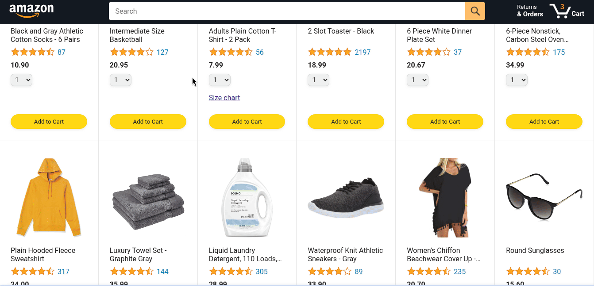
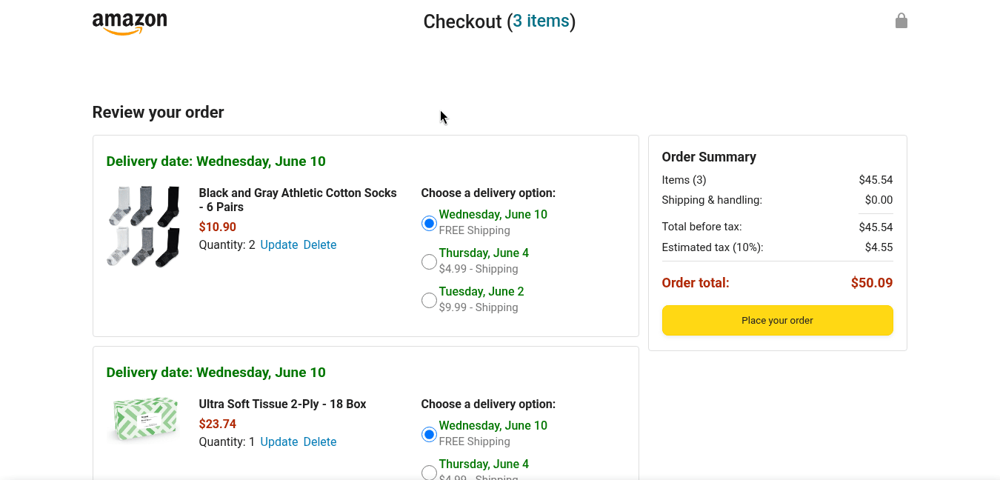
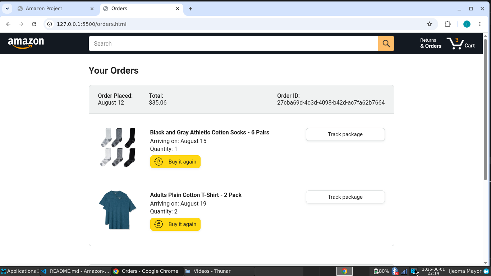
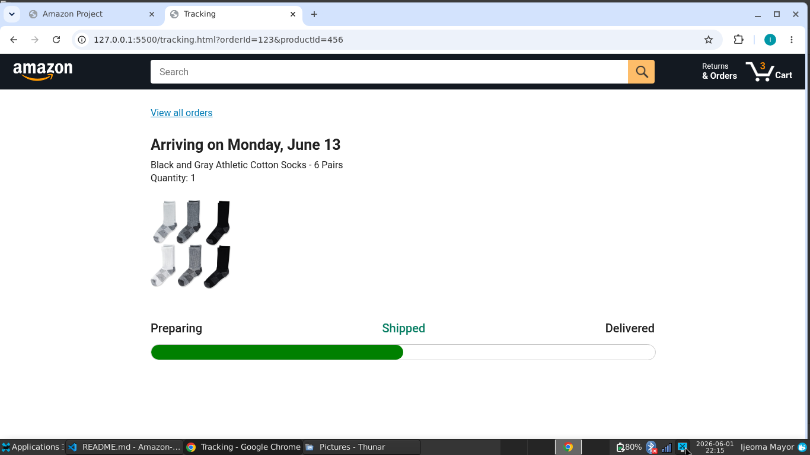

# Amazon Project

An ecommerce demo that showcases product browsing, cart management, and checkout functionality.

## Live Demo

[Live Demo](https://ijeomamayor2004-sketch.github.io/Amazon-project)

## Screenshots / GIFs









## Features

- Product listing with image, price, and rating
- Add items to cart with quantity selection
- Local cart persistence using `localStorage`
- Checkout summary with delivery option selection
- Price breakdown with shipping, tax, and order total
- Order submission to a sample mock backend endpoint
- Order tracking page with search parameter support
- Responsive layout with shared header and page-specific styles

## Tech Stack

- HTML
- CSS
- JavaScript (ES modules)
- Local browser storage (`localStorage`)
- Fetch API for remote product and order data
- Jasmine for unit test coverage

## Getting Started

### Prerequisites

- A modern web browser
- VS code or any other code editor with a Live server extension to enable JavaScript import modules

### Run locally

1. Clone the repository:
   ```
   git clone https://github.com/ijeomamayor2004-sketch/Amazon-project.git
   ```

2. Open `index.html` in your browser using live server.

## Folder Structure

```
Amazon-project/
├── checkout.html
├── index.html
├── orders.html
├── tracking.html
├── data/
│   ├── cart.js
│   ├── deliveryOptions.js
│   ├── orders.js
│   └── products.js
├── scripts/
│   ├── amazon.js
│   ├── checkout.js
│   ├── checkout/
│   │   ├── checkoutHeader.js
│   │   ├── orderSummary.js
│   │   └── paymentSummary.js
│   └── utils/
│       └── money.js
├── styles/
│   ├── pages/
│   ├── shared/
│   └── ...
├── images/
└── tests-jasmine/ 
```

## Testing

Open `tests-jasmine/tests.html` in a browser to run the Jasmine unit tests.

## Notes

- The project currently uses `index.html` as the primary home page.
- Pages orders.html and tracking.html are still under development.
- This project has no real backend, its purely frontend.

